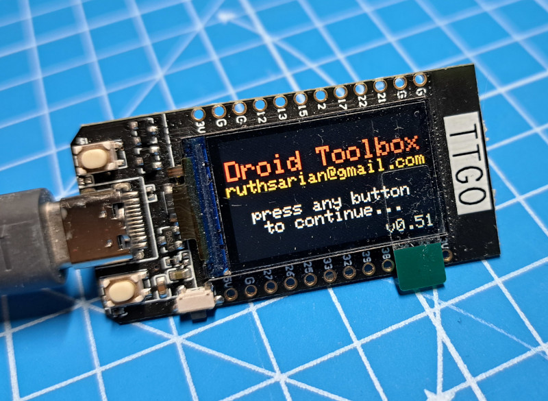
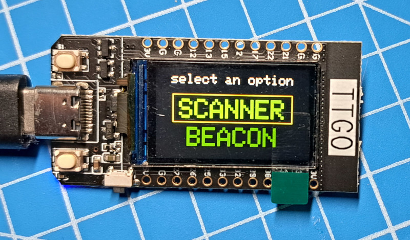
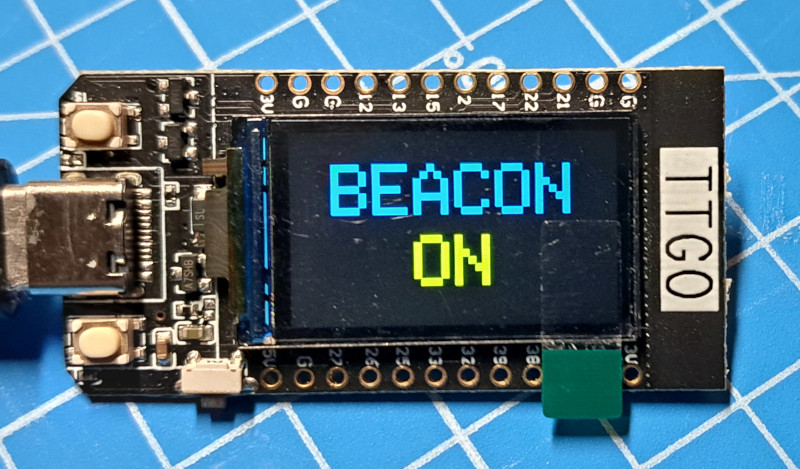

# Droid Toolbox
This is an [Arduino IDE](https://www.arduino.cc/en/software) sketch for ESP32-based devices to interact with [Galaxy's Edge droids](https://disneyworld.disney.go.com/shops/hollywood-studios/droid-depot/). It can emit a bluetooth beacon that droids will react to, scan for nearby droids, and connect to droids and command them to play specific audio tracks from their personality chip. A YouTube video of the Droid Toolbox in action is available at https://www.youtube.com/watch?v=0sHTIEbTevk.

This code was specifically designed for [LILYGO TTGO](http://www.lilygo.cn/prod_view.aspx?Id=1126) devices and may not display correctly on other ESP32 devices without modification.

*Use at your own risk.*

## Features
* Select between emitting a beacon or scanning for nearby droids.
* When the beacon is activated, a random location beacon is generated.
* Connect to droid and make is play a specific track from a specific audio group.

## Button Labeling / TTGO Orientation

* Droid toolbox is designed to be operated with the TTGO held horizontally with the USB port on facing the left.
* The button at top-left (above the USB port) is Button 1.
* The button at the bottom-left (below the USB port) is Button 2.

## Operation

* Upon startup, press either button 1 or 2 to enter the main menu.
* Press button 2 to change options in the main menu.
* Press button 1 to select the highlighted option from the main menu.

### Button Press Types
* A button press is not registered until the button is released.
* Droid toolbox detects short and long button presses.
* A short press is any press in which the button is held down for less than 500ms.
* A long press is any press that lasts for 500ms or longer.
* If a button press type is not explicitly stated in the instructions below, either press type applies.

### Beacon

* Press button 1 to toggle the beacon on and off.
* The beacon is a location beacon. The location is chosen at random every time it is activated.
* Press button 2 to exit the beacon mode. If a beacon is active when button 2 is pressed it will be deactivated.

### Scanning

* Upon selecting the scanner option a scan is initiated. After a few seconds the results of the scan are displayed
* If no droids are detected, a message will be displayed.
* If more than one droid is detected, a button 1 short press will step to the next droid in the results.
* A button 1 long press will cause the droid toolbox to attempt to connect to the droid.
* A button 2 press will return to the main menu.

### Connected

* If the connection attempt fails, be sure your droid's remote is turned off and that the droid is still on.
* Once connected to a droid GROUP and TRACK options are displayed.
* A button 1 short press will increment GROUP or TRACK depending on which is highlighted. If PLAY is highlighted, it will command the droid to play the selected track from the selected group.
* A button 1 long press will either move to the next option (TRACK or PLAY) or play the track when PLAY is highlighted. *This behavior will be changed in a future update.*
* A button 2 short press will step through the options to select a group number, a track number, and play.
* A button 2 long press will disconnect from the droid and return to the droid scan results.

## About Audio Tracks
Galaxy's Edge droids have [personality chips](https://plandisney.disney.go.com/question/dose-droid-personality-406556/). Droids come with a built-in personality chip, but can be modified by plugging in an extra personality chip which overrides the internal personality chip. The personality chip is a collection of audio clips which play when a droid reacts to location beacons, nearby droids, or button presses on the droid's remote control. The audio clips are divided into 12 separate groups. The first 7 groups represent 7 areas within Galaxy's Edge and are what plays when a droid reacts to a beacon. Group 8 through 12 contain special audio clips used with droid accessories (for R-units) and special circumstances, such as when a droid is first activated inside Droid Depot. 

Droid Toolbox allows you to select between the 12 groups and select an audio track within that group. The number of audio clips for a given group can vary between personality chips. While we know how many clips there are for stock personality chips, custom personality chips could have as many audio clips as you want. As such you'll be able to select up to audio track 99, even though the number of tracks typically goesn't go beyond 6. If you try to play an audio track number that doesn't exist the droid will simply do nothing.

### Audio Groups and their Uses
|Group|Purpose|
|---|---|
|1|Location: Market Area|
|2|Location: [Droid Depot](https://disneyworld.disney.go.com/shops/hollywood-studios/droid-depot/)|
|3|Location: Resistance Area|
|4|Location: Unkown \*|
|5|Location: [Oga's Cantina](https://disneyworld.disney.go.com/dining/hollywood-studios/ogas-cantina/) \*\*|
|6|Location: [Dok-Ondar's Den of Antiquities](https://disneyworld.disney.go.com/shops/hollywood-studios/dok-ondars-den-of-antiquities/)|
|7|Location: First Order Area|
|8|Droid Activation|
|9|Unused R-unit Accessory|
|10|Unused and Empty|
|11|Blaster R-Unit Accessory|
|12|Thruster R-Unit Accessory|

*\* No location beacon for this value has been seen inside Galaxy's Edge*

*\*\* Only seen at the entrance to Oga's; possibly the droid detectors?*

## References
* [Controlling Disney’s Droids from Droid Depot with WebBluetooth](https://medium.com/@baptistelaget/controlling-disneys-droids-from-droid-depots-with-webbluetooth-febbabe50587)
* [bashNinja's BLE scan from Galaxy's Edge](https://discord.com/channels/478345594641973248/596058282087546968/626179189115977748) shared with the #makerspace channel of the [Galaxy's Edge Discord Server](http://swgediscord.com)
* [Dead Bothans Society Beacon Map](https://docs.google.com/spreadsheets/d/1zIZb7uUxUe7ewypnTGrzrX1FA85U5mn2XtULZbcXqI8/edit#gid=0)
* [VProFX's Interactive Map of Beacon Locations](http://galaxysedgetech.epizy.com/?i=1)
* [Galaxy's Edge Research - Bluetooth Beacons](https://docs.google.com/spreadsheets/d/13P_GE6tNYpGvoVUTEQvA3SQzMqpZ-SoiWaTNoJoTV9Q/edit#gid=372067469)
