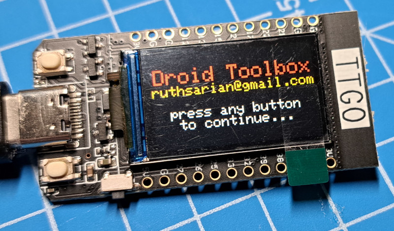
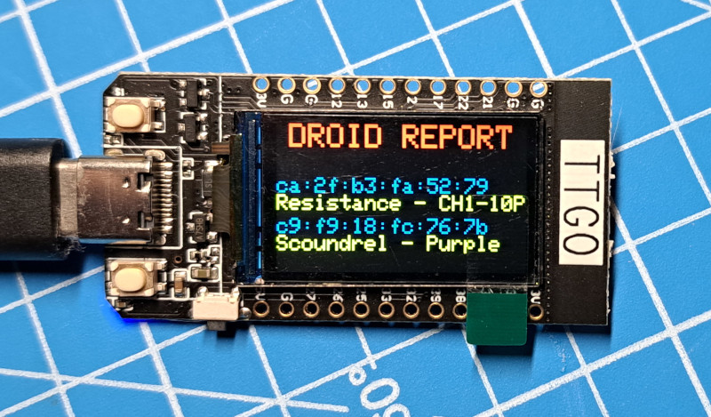

# Droid Toolbox
This is an [Arduino IDE](https://www.arduino.cc/en/software) sketch for ESP32-based devices to scan for nearby [Galaxy's Edge droids](https://disneyworld.disney.go.com/shops/hollywood-studios/droid-depot/) and display a list of those that were found. It can also emit a beacon to which Galaxy's Edge droids will react.

This code was specifically designed for [LILYGO TTGO](http://www.lilygo.cn/prod_view.aspx?Id=1126) devices and may not display correctly on other ESP32 devices without modification.

Use at your own risk.

## Features
* Select between emitting a beacon or scanning for nearby droids
* When the beacon is activated, a random location beacon is generated.

## ToDo
This code started out as a proof-of-concept. There's a lot about it that can be improved upon. 

## Images of Working Example

